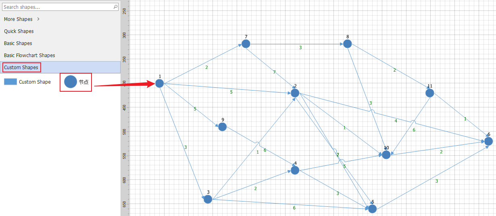
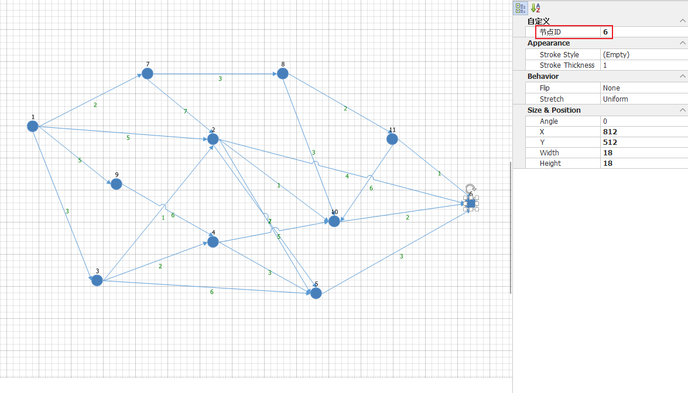
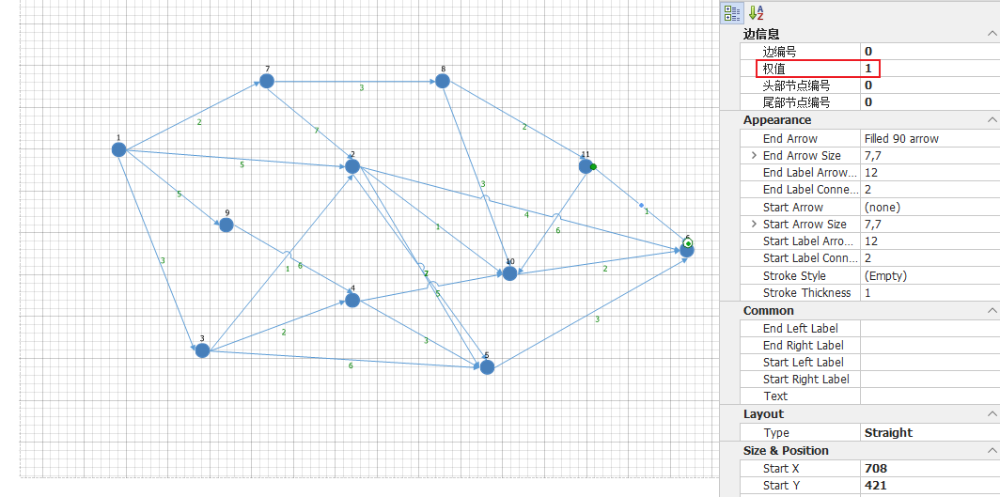
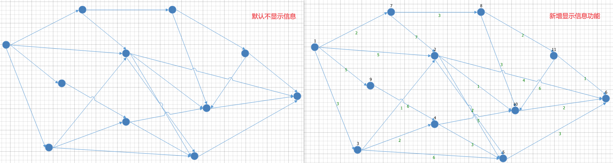
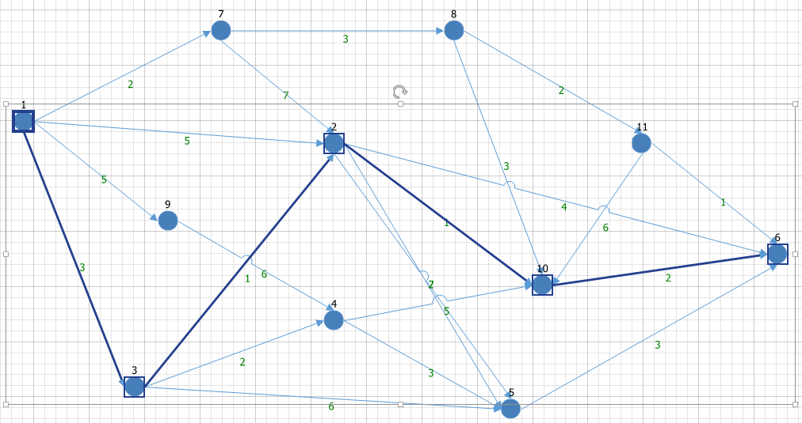
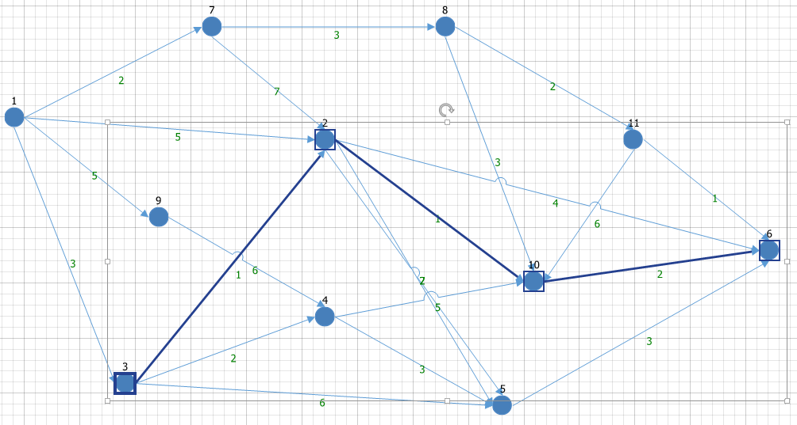

# .NET项目使用Devexpress控件DiagramControl和QuikGraph类库实现最短路径算法可视化

说明：

* 使用控件：DevExpress V24.1.3

## 简介

### 最短路径算法——Dijkstra算法

Dijkstra算法用于找到从单个源节点到图中所有其他节点的最短路径，适用于加权图（边有权重），但权重必须是非负的

步骤：

1. 初始化起点到自身的距离为0，其他节点的距离为∞
2. 将起点标记为已访问，所有其他节点为未访问
3. 对于当前节点，检查所有相邻节点的未访问节点，计算其到起点的距离。如果这个距离小于当前记录的距离，就更新它
4. 选择未访问节点中距离起点最近的节点作为下一个当前节点，重复步骤3
5. 直到所有节点都被访问过

### QuikGraph

QuikGraph是一个用于C#的强大且灵活的图数据结构和算法库。它提供了多种图表示形式和常见的图算法，可以轻松地在.NET应用程序中处理图形数据

主要特性

* **多种图类型**：支持有向图、无向图、多重图等多种图类型
* **丰富的算法**：包括遍历、最短路径、最大流、最小生成树等常见的图算法
* **灵活的接口**：通过接口定义图的数据结构，使得用户可以自定义图的实现
* **良好的性能**：经过优化，适用于处理大规模图数据

### DevExpress的DiagramControl

DevExpress的DiagramControl是一个强大的控件，允许开发者在WinForms和WPF应用程序中创建、编辑和显示复杂的图表和流程图。它提供了多种工具和功能，帮助用户以交互和直观的方式构建和管理图形化数据表示

主要特性

1. **支持多种图表类型**：包括流程图、组织结构图、状态图等
2. **丰富的图元库**：提供预定义的形状、连接线和图元，用户也可以自定义图元
3. **交互功能**：支持拖放、缩放、旋转、对齐、分组等交互操作
4. **数据绑定**：可以绑定到数据源，动态生成图表
5. **导入/导出**：支持将图表导出为多种格式（如 PNG、JPEG、SVG、PDF 等），以及从多种格式导入
6. **布局算法**：内置多种自动布局算法，如树形布局、层次布局等
7. **事件处理**：丰富的事件模型，方便开发者处理用户交互和自定义行为
8. **主题支持**：与 DevExpress 其他控件一致，支持多种主题和样式

## 项目重点

### 需求

* 节点：能从元件工具栏拖拽节点元件到绘制区域完成绘制节点，在节点属性栏自定义节点编号
* 边：能够绘制有向边，在边属性栏自定义边的权值
* 最短路径可视化：完整显示最短路径
* 额外信息显示：显示节点编号和边的权值

### 自定义元件工具栏

自定义元件工具栏，工具栏定义我们用于绘制图节点的元件，可以自定义元件的背景图片和显示文字等

然后就可以从工具栏拖拽该元件到右侧绘图区域完成图节点的绘制

​​

```cs
 var stencil = new DevExpress.Diagram.Core.DiagramStencil("CustomStencil", "Custom Shapes");

 //注册DiagramShapeEx
 var itemTool = new FactoryItemTool("CustomShape", () => "Custom Shape", diagram => { DiagramShapeEx customShape = new DiagramShapeEx() { Width = 100, Height = 50 }; return customShape; }, new System.Windows.Size(100, 50), false);
 stencil.RegisterTool(itemTool);

 // 注册ShapeImage
 stencil.RegisterTool(new FactoryItemTool("节点", () => "节点", diagram =>
 {
     return new ShapeImage();
 }, new System.Windows.Size(18, 18)));

 DevExpress.Diagram.Core.DiagramToolboxRegistrator.RegisterStencil(stencil);
 DiagramControl.ItemTypeRegistrator.Register(typeof(DiagramShapeEx), typeof(ShapeImage), typeof(CustomConnector));
```

### 自定义节点

可以继承DiagramImage，并自定义连接点，用于边的绘制边时作为边的起点或终点，并且在节点属性栏增加属性“Id”作为节点的唯一编号

```cs
public class ShapeImage : DiagramImage, IShape
{
    public ShapeImage()
    {
        Image = Properties.Resource.node;

        #region 设置连接点
        List<PointFloat> points = new List<PointFloat>();
        points.Add(new PointFloat(0f, 0.5f));
        points.Add(new PointFloat(1f, 0.5f));
        points.Add(new PointFloat(0.5f, 0f));
        points.Add(new PointFloat(0.5f, 1f));
        ConnectionPoints = new PointCollection(points);
        #endregion
    }
    [XtraSerializableProperty, Category("自定义"), DisplayName("节点ID")]

    public int Id { get; set; }

    static ShapeImage()
    {
        DiagramControl.ItemTypeRegistrator.Register(typeof(ShapeImage));
    }
}
```

如图所示，节点6的属性新增了自定义属性“节点ID”

​​

### 自定义边

继承DiagramConnector，自定义属性“权值”用于设置边的权值

```cs
public class CustomConnector : DiagramConnector, IShape
{
    public CustomConnector()
    {

    }
    [XtraSerializableProperty, Category("边信息"), DisplayName("边编号")]
    public int Id { get; set; }
    [XtraSerializableProperty, Category("边信息"), DisplayName("权值")]
    public int WeightVal { get; set; }

    [XtraSerializableProperty, Category("边信息"), DisplayName("头部节点编号")]
    public int BeginNodeNo { get; set; }


    [XtraSerializableProperty, Category("边信息"), DisplayName("尾部节点编号")]
    public int EndNodeNo { get; set; }
    static CustomConnector()
    {
        DiagramControl.ItemTypeRegistrator.Register(typeof(CustomConnector));
    }
}
```

​​

### 显示信息

默认绘制完成是不显示信息，可以新增显示功能，更方便设置和查看节点编号和边权值等

​​

基本思路是绘制不可以被鼠标选择的DiagramShape用来显示编号和权值等信息

```cs
DiagramItemCollection diagramItemCollection = diagramControl1.Items;
foreach (var item in diagramItemCollection)
{
    if (item is null) continue;
    if (item is CustomConnector)
    {
        var con = (item) as CustomConnector;
        var beginRec = con.ActualBeginPoint;
        var endRec = con.ActualEndPoint;
        var delX = endRec.X - beginRec.X;
        var delY = endRec.Y - beginRec.Y;
        nodeInfoShapes.Add(
           new NodeInfoShape()
           {
               Content = con.WeightVal.ToString(),
               FontColor = Color.Green,
               Width = 15,
               Height = 10,
               CenterX = (float)(endRec.X),
               CenterY = (float)(endRec.Y),
               X = (float)((beginRec.X + endRec.X) * 0.5),
               Y = (float)((beginRec.Y + endRec.Y) * 0.5),
           }
       );
        continue;
    }
    var shape = (item) as IShape;
    if (shape != null)
    {
        var rect = item.Bounds;
        nodeInfoShapes.Add(
            new NodeInfoShape()
            {
                Content = shape.Id.ToString(),
                FontColor = Color.Black,
                Width = 60,
                Height = 20,
                CenterX = (float)(rect.X + rect.Width * 0.5),
                CenterY = (float)(rect.Y - NODE_NAME_Y_OFFSET),
                X = (float)(rect.X + rect.Width * 0.5 - 60.0 * 0.5),
                Y = (float)(rect.Y - NODE_NAME_Y_OFFSET - 20.0 * 0.5),
            }
        );
    }
}
foreach (var item in nodeInfoShapes)
{
    DiagramShape diagramShape = new DiagramShape()
    {
        Content = item.Content,
        Width = item.Width,
        Height = item.Height,
        CanSelect = false,
        CanEdit = false,
        CanResize = false,
        Position = new PointFloat(item.X, item.Y),
        Appearance =
        {
            BackColor = Color.Transparent, FontSizeDelta = -1, ForeColor = item.FontColor,
            BorderSize = 0
        },
        CanSnapToThisItem = false,
        CanAttachConnectorBeginPoint = false,
        CanAttachConnectorEndPoint = false,
        CanCopy = false,
        CanMove = false,
        CanDelete = false,
        CanRotate = false,
        Tag = "info"
    };
    diagramControl1.Items.Add(diagramShape);
}
```

### 最短路径算法

这里使用QuikGraph类库来实现

```cs
 public static List<PathDistanceRec> GetShortestPath(AdjacencyGraph<string, SEquatableTaggedEdge<string, double>> graph,
     string start, string end)
 {
     List<PathDistanceRec> pathDistanceRecs = new List<PathDistanceRec>();
     // 使用 Dijkstra 算法找到最短路径
     var algorithm = new DijkstraShortestPathAlgorithm<string, SEquatableTaggedEdge<string, double>>(graph, edge => edge.Tag);

     var predecessors = new VertexPredecessorRecorderObserver<string, SEquatableTaggedEdge<string, double>>();
     // 指定起点
     string source = start;
     using (predecessors.Attach(algorithm))
     {
         algorithm.Compute(source);
         foreach (var ver in graph.Vertices)
         {
             if (ver != source && ver == end && algorithm.TryGetDistance(ver, out double distance))
             {
                 List<PathEdge> pathEdges = new List<PathEdge>();
                 List<string> pathList = new List<string>();
                 PathDistanceRec pathDistanceRec = new PathDistanceRec();
                 pathDistanceRec.StartEnd = source + "->" + end;
                 pathDistanceRec.Start = source;
                 pathDistanceRec.End = end;
                 pathDistanceRec.Dis = distance;
                 IEnumerable<SEquatableTaggedEdge<string, double>> path;
                 predecessors.TryGetPath(end, out path);
                 if (path == null) return null;
                 pathDistanceRec.Path = string.Join(",", path);
                 foreach (var step in path)
                 {
                     pathList.Add(step.Source);
                     pathEdges.Add(new PathEdge(step.Source, step.Target));
                 }
                 pathList.Add(end);
                 pathDistanceRecs.Add(pathDistanceRec);
                 pathDistanceRec.PathList = pathList;
                 pathDistanceRec.PathEdges = pathEdges;
             }
         }
     }
     return pathDistanceRecs;
 }
```

## 效果

键盘同时按住Ctrl+Shift键，鼠标任意选择起点和终点，程序自动计算出最短路径并可视化最短路径

如下，起点为1，终点为6

​​

起点为3，终点为6

​​

‍
